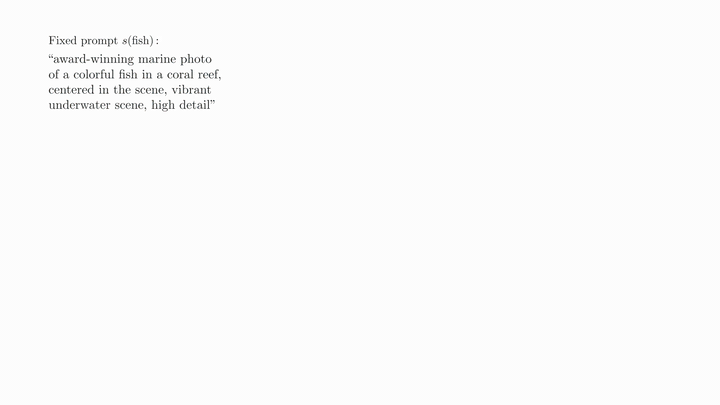
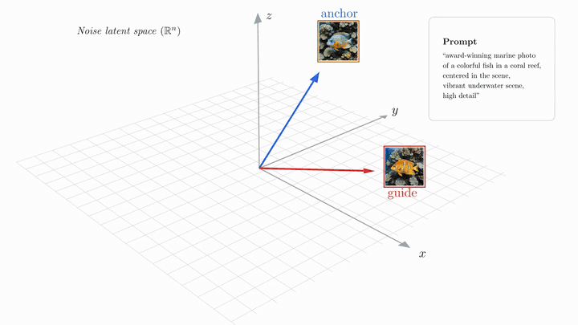
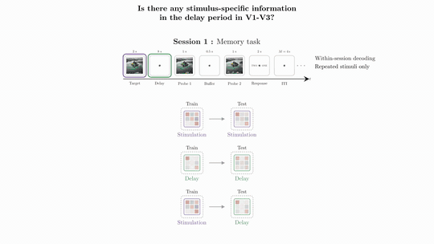
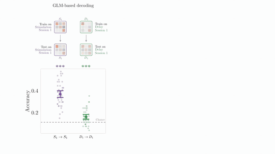

# Thesis Defence Animations

Source repository for my PhD defence presentation built with [Manim](https://www.manim.community/). The project contains the scene code and curated, restricted assets used to produce videos and Keynote slides. The talk was organised into an introduction, methods, two main study sections, a conclusion, and supplementary material.


## What This Repository Contains

- `scenes/`: production Manim scenes and clip wrappers
- `assets/`: tracked restricted figures, videos, manifests, presenter notes, and documented sync targets
- `scripts/`: deck assembly, packaging, and project tooling

Supporting project configuration lives at the repository root in `pyproject.toml`, `uv.lock`, and `manim.cfg`.

For the public-release readiness checklist, see [PUBLICATION_REVIEW.md](PUBLICATION_REVIEW.md).

## Preview

### Study 1 Stage 1 Step 2

[](media/videos/03_study1/1080p60/sections/002_study1_stage1_step2.mp4)

[Open the full MP4](media/videos/03_study1/1080p60/sections/002_study1_stage1_step2.mp4).

### Study 1 Stage 1 Step 4 Interpolation

[](media/videos/03_study1/1080p60/sections/007_study1_stage1_step4_interpolation.mp4)

[Open the full MP4](media/videos/03_study1/1080p60/sections/007_study1_stage1_step4_interpolation.mp4).

### Study 2 Within-Session 1 Decoding Results

#### A-B

[](media/videos/04_study2/1080p60/sections/013_014_study2_within_session1_decoding_results_ab.mp4)

[Open the combined A-B MP4](media/videos/04_study2/1080p60/sections/013_014_study2_within_session1_decoding_results_ab.mp4).

#### B-C

[](media/videos/04_study2/1080p60/sections/014_015_study2_within_session1_decoding_results_bc.mp4)

[Open the combined B-C MP4](media/videos/04_study2/1080p60/sections/014_015_study2_within_session1_decoding_results_bc.mp4).

Individual clips:
[A](media/videos/04_study2/1080p60/sections/013_study2_within_session1_decoding_results_a.mp4),
[B](media/videos/04_study2/1080p60/sections/014_study2_within_session1_decoding_results_b.mp4),
[C](media/videos/04_study2/1080p60/sections/015_study2_within_session1_decoding_results_c.mp4),
[D](media/videos/04_study2/1080p60/sections/016_study2_within_session1_decoding_results_d.mp4).

More rendered clips are available under `media/videos/**/1080p60/sections/`.

## Quick Start

Use Python 3.12+ with `uv`. Rendering the full presentation also needs the
usual Manim system dependencies, including LaTeX for `Tex`, plus `ffmpeg` and
`ffprobe` for video/report tooling.

```bash
uv sync
```

Most paths work from repo-local defaults. If your private source repositories
live somewhere else, set the documented override variables in your shell or in
an untracked `.env` file.

## Asset Model

The public repository keeps the scene source self-contained where possible, but some larger study inputs are intentionally not committed. Code and assets have separate reuse terms.

- Tracked in Git: scene-adjacent restricted figures, videos, manifests, presenter notes, and compact public-source assets
- Synced locally: larger study inputs restored through `scripts/sync_external_assets.py`
- Generated locally: Manim partial movie files, stills, reports, Keynote exports, PDFs, and other disposable build products

For provenance notes and sync groups, see [assets/README.md](assets/README.md). For asset reuse terms, see [ASSET_RIGHTS.md](ASSET_RIGHTS.md).

To populate the local-only sync targets:

```bash
uv run python scripts/sync_external_assets.py --groups small
uv run python scripts/sync_external_assets.py --all
```

Use `--groups small` for the normal portable setup. Use `--all` only when you need the larger Study 1 source assets.

## Rendering Clips

The documented render path is clip-based. Use `scenes/clips.py` to render production clips directly into the numbered `media/videos/**/sections/` folders with the expected filenames.

Quality flags:

- `-ql`: `480p15`
- `-qm`: `720p30`
- `-qh`: `1080p60`
- `-qk`: `2160p60`

Examples:

```bash
uv run manim scenes/clips.py IntroCognitiveProblemA -qh
uv run manim scenes/clips.py Study1Stage1Step2 -qh
uv run manim scenes/clips.py Study2CrossSessionDecodingSetup -qh
uv run manim scenes/clips.py ConclusionApproach -qh
uv run manim scenes/clips.py SupplementaryIntroResearchQuestion1 -qh
```

Supplementary wrappers that reuse intro or study-1 scene classes are prefixed
with `Supplementary` so each clip name resolves to exactly one output path.

The underlying production scene modules are:

- `scenes/intro.py`
- `scenes/methods.py`
- `scenes/study1.py`
- `scenes/study2.py`
- `scenes/conclusion.py`
- `scenes/supplementary.py`

## Building The Deck

After the required section clips exist locally, build the Keynote deck on macOS with Keynote installed:

```bash
osascript scripts/create_keynote_presentation.applescript
osascript scripts/create_keynote_presentation.applescript --quality-folder auto
osascript scripts/create_keynote_presentation.applescript -qh
osascript scripts/create_keynote_presentation.applescript --quality-folder 1080p60
```

The deck builder reads `assets/presentation_deck.toml` and resolves numbered section clips under `media/videos/**/sections/`. Presenter notes can live in `assets/presenter_notes.md`, using repo-relative media targets such as `## media/videos/03_study1/{{quality_dir}}/sections/000_study1_scene.mp4`.

Manifest expansion and preflight checks are release-artifact checks. They are
expected to fail in a fresh source clone until the referenced clips have been
rendered or restored under `media/videos/**/sections/`.

Related local-only helper commands:

```bash
uv run python scripts/build_static_rescue_deck.py
uv run python scripts/presentation_preflight.py --presentation-file /path/to/deck.key
uv run python scripts/package_emergency_bundle.py --presentation-file /path/to/deck.key
```

## Generated Outputs

`media/` is mostly disposable local build output. The final rendered 1080p section MP4s under `media/videos/**/1080p60/sections/` are tracked for preview and deck reuse; Manim partial movie files, stills, reports, fallback bundles, and Keynote exports remain ignored.

Final `.key`, `.pptx`, and exported `.pdf` deliverables should be published as release artifacts, not committed into repository history.

## License

Source code is licensed under the MIT license in [LICENSE](LICENSE).

Non-code assets are not covered by the MIT license unless explicitly stated.
See [ASSET_RIGHTS.md](ASSET_RIGHTS.md) before reusing figures, stimuli, data,
videos, presenter notes, or generated presentation exports.
